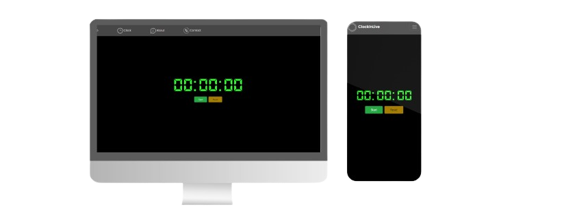

<h1 align="center" style="font-weight: bold;">Cronometro-Dev 💻</h1>

 

 <a href="#tech">Tecnologias</a> • 
 <a href="#started">Começando</a> • 
  •

     <a href="https://hcinfo9.github.io/Dev-Sorteio/](https://hcinfo9.github.io/Cronometro-Dev/">📱 Visite este Projeto</a>

<h2 id="layout">🎨 Layout:</h2>

    

<h2 id="tech">💻 Tecnologias:</h2>
  <ul>
      <li></li>
      <li></li>
      <li></li>
      <li></li>
      
  </ul>
<h2 id="started">🚀 Descrição:</h2> 

Este projeto foi desenvolvido como parte de um exercício prático para demonstrar habilidades em HTML, CSS, BootStrap e JavaScript. Ele oferece uma interface simples e intuitiva para acompanhar o tempo e pode ser útil em diversas situações do dia a dia.  

<h3>Pre-Requisitos:</h3> 

Antes de executar a aplicação, certifique-se de ter os seguintes requisitos instalados em sua máquina:
Navegador Web (Google Chrome, Mozilla Firefox, etc.) 

Conexão com a internet para carregar recursos externos, como o framework Bootstrap.  

<h3>Executando o Projeto:</h3> 

Para executar a aplicação localmente, siga estas etapas:

<ul>
  <li>Clone este repositório em sua máquina local ou faça o download do arquivo ZIP
</li>
  <li>Navegue até o diretório onde você salvou o código-fonte da aplicação.</li>
  <li>Abra o arquivo index.html em seu navegador da web.</li>
  <li>Iniciar: Pressione o botão "Start" para iniciar o cronômetro.</li>
  <li>Parar: Pressione o botão "Stop" para pausar o cronômetro.</li>
  <li>Resetar: Pressione o botão "Reset" para reiniciar o cronômetro.</li>
  <li>Horario e data atual: Clique em Clock.</li>
</ul>  

<h2 id="colab">🤝 Colaboradores:</h2>

Um obrigado especial aos colaboradores do Projeto.

<table>
  <tr>
    <td align="center">
      <a href="#">
         
        
          <b>Henrique Donato</b>
        
      </a>
    </td>
</table>
